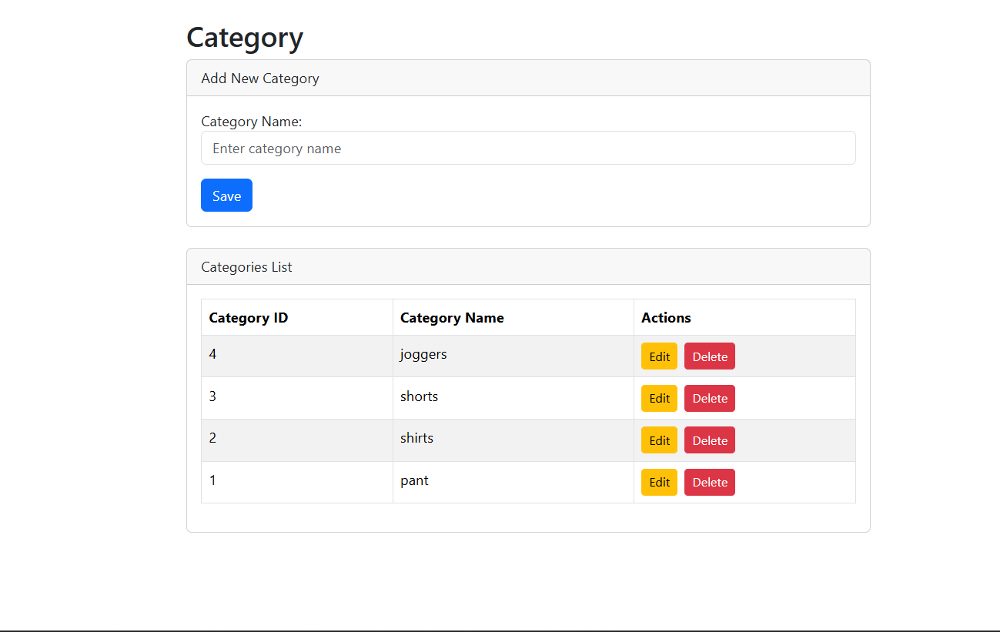
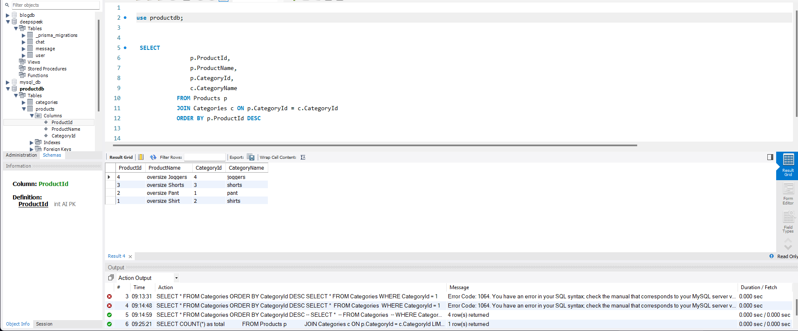
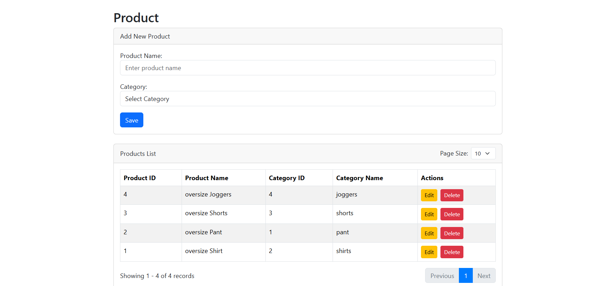

# Nodejs Machine Test

## Project Structure

- backend → Node.js API
- frontend → Frontend application

## Setup Instructions

### Backend

cd backend
npm install
npm run dev

### Frontend

cd frontend
npm install
npm start

## Project Screenshot

database image

category image
go to   http://localhost:4200/categories

product image
go to   http://localhost:4200/products
